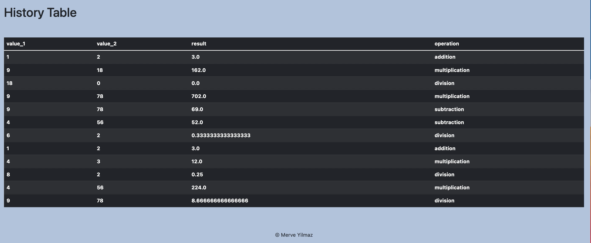

# Calculator Project Branch 6
## Added Branch with Improvements. Contains Link to YouTube walkthrough

[Link to 30 Second Walkthrough](https://youtu.be/v-MEuc1uhZQ)

[Link to 39 Second Walkthrough](https://youtu.be/xGLSzn1Kmfw)

1. Run Pip Install
pip install -r requirements.txt

2. To run tests, Lint, and Coverage report use this command: pytest  --pylint --cov

# Pylint Coverage Screenshots:

# Flash Messaging Screenshots

# Bootstrap Table Screenshot

